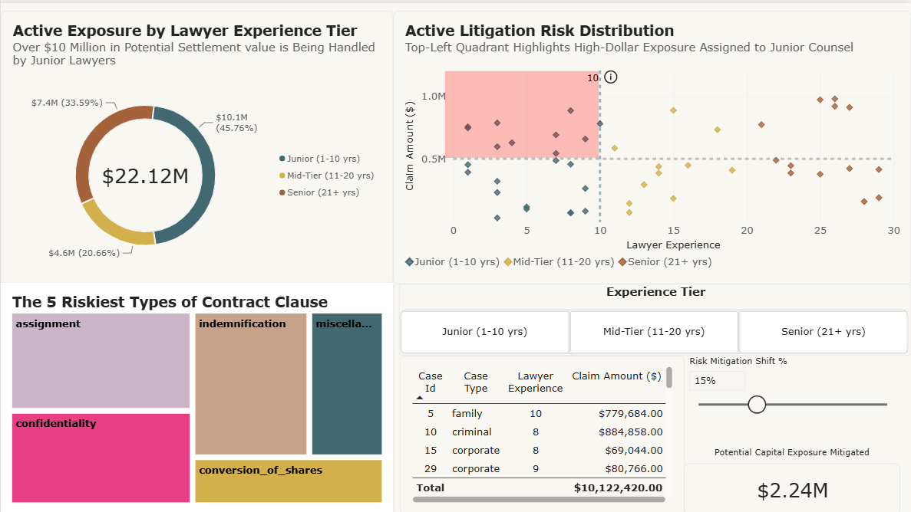
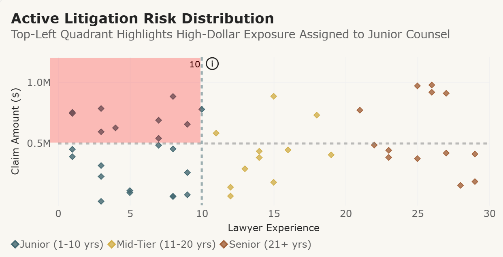
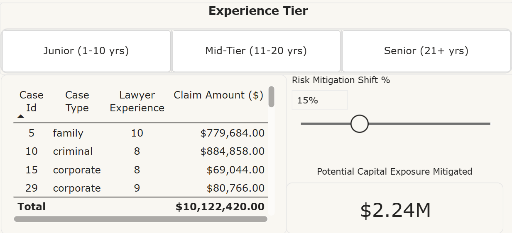
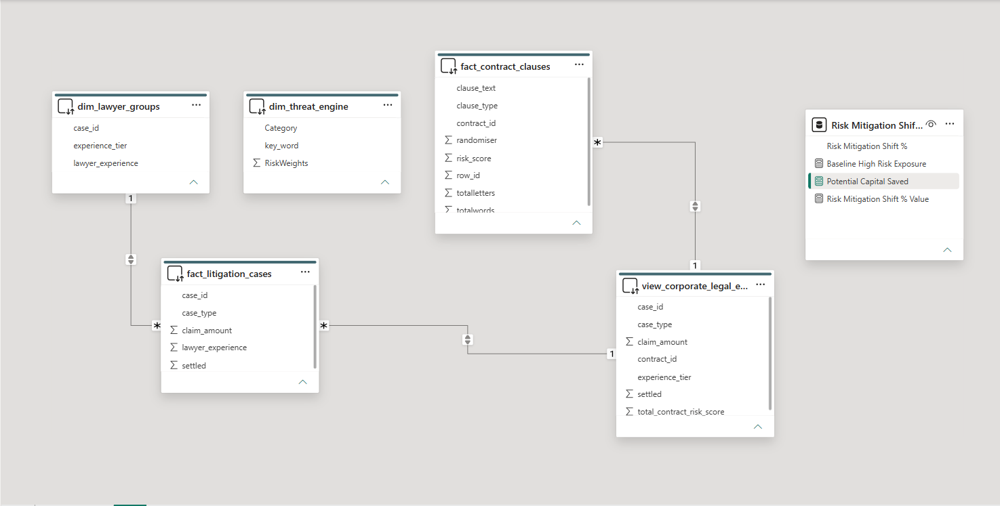

# Legal-Risk-Audit.-2-Fabric-BI
A Legal Risk Audit and Executive Dashboard. Fabric/Power BI
# Legal Threat Engine & Risk Analytics

## Overview
Corporate legal departments frequently face structural inefficiencies in how litigation exposure is assigned and managed. Without centralised risk visibility, high-value lawsuits are often allocated based on capacity rather than staff seniority. This exposes firms to avoidable financial liabilities.

This end-to-end analytics solution processes raw contract and case management data to identify high-risk exposure zones, quantify potential settlement liabilities, and aid in executive decision-making using a dynamic scenario-planner.

___

## Key Business Problems Solved

1. High-Value Litigation Exposure Assigned to Junior Staff
   * The Problem: Junior counsel (<= 10 years experience) were handling complex, high-dollar cases ($500k+), creating an unquantified liability risk for the organization.
   * The Solution: Developed a litigation risk scatter plot featuring a visual "Danger Zone". This instantly highlights edge cases where unacceptable financial risk may lie.

2. Simple Reporting vs. Actionable Decision Support
   * The Problem: Standard corporate reporting tends to show historical data without offering actionable insights going forward.
   * The Solution: I Implemented an interactive What-If Scenario Planner powered by dynamic DAX parameters. Executives can simulate the benefits of re-assigning high-value cases to more senior employees, instantly calculating the exact capital exposure mitigated (e.g., $1.50M to $4.49M in risk reallocated).

3. Fragmented Contract Risk Tracking
   * The Problem: Contractual liabilities were siloed across legacy Excel sheets and case tables, hiding systemic vulnerabilities in high-risk clause types.
   * The Solution: Standardized raw contract clause metrics into a clear threat distribution visual, identifying which types of clauses generated the most compliance risk (such as assignment, indemnification, and confidentiality clauses). This can then be used to inform future contract-handling.

___

## Technical Architecture & Pipeline Strategy

To deliver these insights, the project progressed through an end-to-end data pipeline designed to clean, structure, and model raw operational files:

Excel / CSV Sources
v
Data Cleaning & Transformation
v
Fabric / Semantic Model
v
Power BI Dashboard

* Data Ingestion & Transformation: I processed the initial operational datasets (Excel/CSVs) containing case histories, lawyer demographics, and clause threat scores. I applied data typing, handling missing values, and establishing relational primary/foreign key mappings across case and lawyer entities.
* Semantic Model: I built a star-schema model (fact_litigation_cases, dim_lawyer_groups, dim_threat_engine) in Microsoft Fabric, then live-connected Power BI Desktop to the semantic model using a composite DirectQuery. Doing it this way supported the measures I needed for the custom scenarios without compromising the central model.
* DAX & Scenario Modeling: I engineered composite measures to calculate baseline high-risk exposure, dynamic target shift percentages, and real-time capital mitigation metrics.

___

## Business Impact and Deliverables
* Risk Reduction: Directly identified over $10M+ in unnecessary active exposure currently assigned to junior staff.
* Capital Protection: Provides a real-time scenario tool capable of modeling $4.49M+ in immediate exposure mitigation using targeted case re-assignment.
* Operational Efficiency: Gives senior management a single-page interactive control centre in the form of a dashboard, to filter cases by lawyer experience tier, clause vulnerability, and individual case ID in real time.

